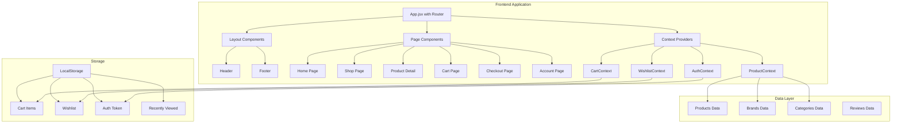
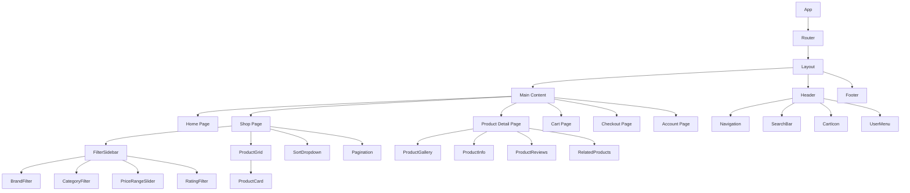
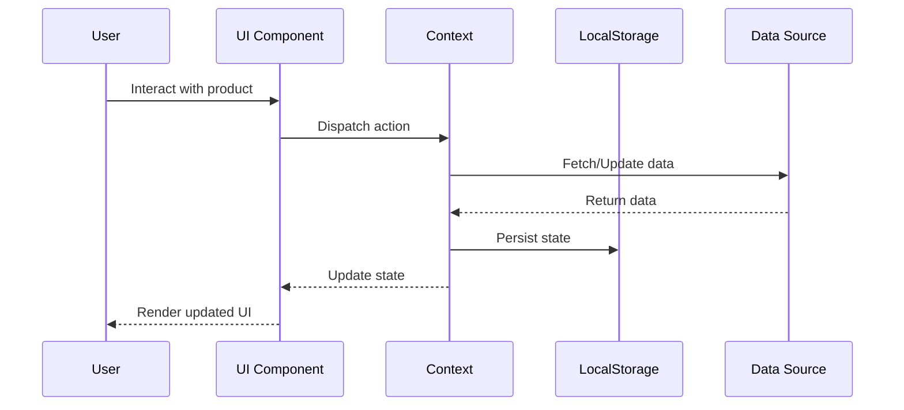
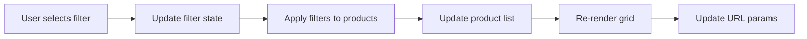
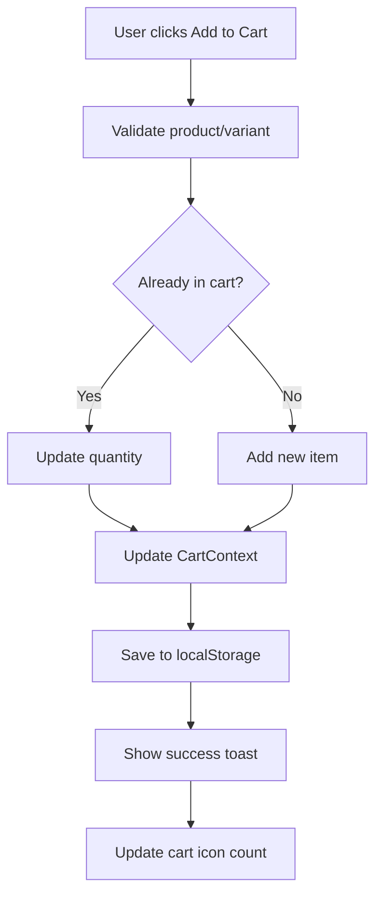
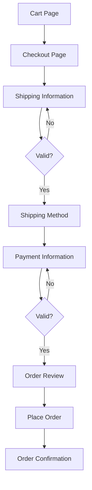

# BeautyArena Implementation Roadmap

## Executive Summary

This document outlines the step-by-step implementation plan for transforming BeautyArena into a professional e-commerce platform. The implementation is divided into 7 phases, each building upon the previous one.

## System Architecture Overview



## Component Hierarchy



## Data Flow Architecture



## Phase 1: Foundation Setup

### Objectives
- Install required dependencies
- Set up routing infrastructure
- Create context providers
- Establish folder structure

### Tasks
1. Install dependencies
   ```bash
   npm install react-router-dom @headlessui/react react-hot-toast
   ```

2. Create folder structure
   - `/src/pages/`
   - `/src/context/`
   - `/src/hooks/`
   - `/src/data/`
   - `/src/utils/`

3. Set up React Router in [`App.jsx`](beautyarena/src/App.jsx:1)

4. Create context providers:
   - [`CartContext.jsx`](beautyarena/src/context/CartContext.jsx:1)
   - [`WishlistContext.jsx`](beautyarena/src/context/WishlistContext.jsx:1)
   - [`AuthContext.jsx`](beautyarena/src/context/AuthContext.jsx:1)
   - [`ProductContext.jsx`](beautyarena/src/context/ProductContext.jsx:1)

5. Create custom hooks:
   - `useCart.js`
   - `useWishlist.js`
   - `useAuth.js`
   - `useLocalStorage.js`

### Deliverables
- Working routing system
- Context providers ready
- Folder structure complete
- Dependencies installed

### Estimated Time: 2-3 hours

---

## Phase 2: Design System Overhaul

### Objectives
- Remove all emojis
- Implement sentence case throughout
- Add subtle section headers
- Create reusable UI components

### Tasks
1. Update [`index.css`](beautyarena/src/index.css:1) with new design tokens

2. Create common components:
   - `Button.jsx` - Reusable button with variants
   - `Badge.jsx` - Status badges and labels
   - `Input.jsx` - Form input component
   - `SectionHeader.jsx` - Consistent section headers

3. Update existing components:
   - [`HeroSection.jsx`](beautyarena/src/components/sections/HeroSection.jsx:1) - Remove emojis, update text
   - [`ServicesSection.jsx`](beautyarena/src/components/sections/ServicesSection.jsx:1) - Replace emojis with icons
   - [`Header.jsx`](beautyarena/src/components/layout/Header.jsx:1) - Update navigation text
   - [`Footer.jsx`](beautyarena/src/components/layout/Footer.jsx:1) - Sentence case updates

4. Create icon mapping system for services/products

### Design Changes
- Replace "💇‍♀️" with `<Scissors />` icon
- Replace "💅" with `<Sparkles />` icon
- Replace "✨" with `<Star />` icon
- Replace "💄" with `<Palette />` icon
- Change "Programează programare" to "Book appointment"
- Change "Produse premium" to "Premium products"

### Deliverables
- No emojis in UI
- All text in sentence case
- Consistent design system
- Reusable components

### Estimated Time: 3-4 hours

---

## Phase 3: Product Data & Brand System

### Objectives
- Create comprehensive product database
- Implement brand management
- Set up category structure

### Tasks
1. Create [`brands.js`](beautyarena/src/data/brands.js:1) with 10+ brands:
   ```javascript
   {
     id: 'loreal',
     name: "L'Oréal Paris",
     slug: 'loreal-paris',
     description: 'Luxury French cosmetics',
     logo: '/brands/loreal.svg',
     featured: true,
     productCount: 45
   }
   ```

2. Create [`products.js`](beautyarena/src/data/products.js:1) with 50+ products:
   - Include all required fields
   - Multiple categories
   - Various price ranges
   - Different brands
   - Product variants

3. Create [`categories.js`](beautyarena/src/data/categories.js:1):
   - Skincare (subcategories: cleansers, moisturizers, serums)
   - Makeup (subcategories: face, eyes, lips)
   - Haircare (subcategories: shampoo, conditioner, styling)
   - Nails
   - Fragrance
   - Tools

4. Create [`mockReviews.js`](beautyarena/src/data/mockReviews.js:1) for products

### Deliverables
- Complete product database
- Brand data with logos
- Category hierarchy
- Mock reviews

### Estimated Time: 4-5 hours

---

## Phase 4: Shop Page Implementation

### Objectives
- Build dedicated shop page
- Implement advanced filtering
- Add sorting functionality
- Create product grid

### Tasks
1. Create [`ShopPage.jsx`](beautyarena/src/pages/ShopPage.jsx:1)

2. Build filter components:
   - [`FilterSidebar.jsx`](beautyarena/src/components/shop/FilterSidebar.jsx:1)
   - [`BrandFilter.jsx`](beautyarena/src/components/shop/BrandFilter.jsx:1)
   - [`CategoryFilter.jsx`](beautyarena/src/components/shop/CategoryFilter.jsx:1)
   - [`PriceRangeSlider.jsx`](beautyarena/src/components/shop/PriceRangeSlider.jsx:1)
   - [`RatingFilter.jsx`](beautyarena/src/components/shop/RatingFilter.jsx:1)

3. Create product display:
   - [`ProductGrid.jsx`](beautyarena/src/components/shop/ProductGrid.jsx:1)
   - [`ProductCard.jsx`](beautyarena/src/components/shop/ProductCard.jsx:1) - Redesigned without emojis
   - [`SortDropdown.jsx`](beautyarena/src/components/shop/SortDropdown.jsx:1)

4. Implement filtering logic:
   - Create `useFilters.js` hook
   - Multi-select brand filtering
   - Price range filtering
   - Category filtering
   - Rating filtering
   - In-stock filtering

5. Add pagination:
   - [`Pagination.jsx`](beautyarena/src/components/shop/Pagination.jsx:1)
   - Items per page selector
   - Page navigation

6. Implement view modes:
   - Grid view (2, 3, 4 columns)
   - List view
   - View toggle buttons

### Filter Flow


### Deliverables
- Fully functional shop page
- Working filters
- Sorting options
- Pagination
- Responsive grid

### Estimated Time: 6-8 hours

---

## Phase 5: Product Detail & Cart

### Objectives
- Create product detail page
- Implement shopping cart
- Add wishlist functionality

### Tasks
1. Build product detail page:
   - [`ProductDetailPage.jsx`](beautyarena/src/pages/ProductDetailPage.jsx:1)
   - [`ProductGallery.jsx`](beautyarena/src/components/product/ProductGallery.jsx:1)
   - [`ProductInfo.jsx`](beautyarena/src/components/product/ProductInfo.jsx:1)
   - [`ProductReviews.jsx`](beautyarena/src/components/product/ProductReviews.jsx:1)
   - [`RelatedProducts.jsx`](beautyarena/src/components/product/RelatedProducts.jsx:1)

2. Implement cart functionality:
   - [`CartDrawer.jsx`](beautyarena/src/components/cart/CartDrawer.jsx:1) - Slide-out drawer
   - [`CartItem.jsx`](beautyarena/src/components/cart/CartItem.jsx:1)
   - [`CartSummary.jsx`](beautyarena/src/components/cart/CartSummary.jsx:1)
   - [`CartPage.jsx`](beautyarena/src/pages/CartPage.jsx:1)

3. Add wishlist:
   - Wishlist icon in header
   - Add/remove from wishlist
   - Wishlist page
   - Persist in localStorage

4. Implement variant selection:
   - Color picker
   - Size selector
   - Price updates

5. Add quantity selector with validation

### Cart Flow


### Deliverables
- Product detail page
- Working shopping cart
- Wishlist functionality
- Variant selection
- Cart persistence

### Estimated Time: 8-10 hours

---

## Phase 6: Checkout & Authentication

### Objectives
- Build checkout flow
- Implement user authentication
- Create account pages

### Tasks
1. Create checkout flow:
   - [`CheckoutPage.jsx`](beautyarena/src/pages/CheckoutPage.jsx:1)
   - [`ShippingForm.jsx`](beautyarena/src/components/checkout/ShippingForm.jsx:1)
   - [`PaymentForm.jsx`](beautyarena/src/components/checkout/PaymentForm.jsx:1)
   - [`OrderSummary.jsx`](beautyarena/src/components/checkout/OrderSummary.jsx:1)

2. Implement form validation:
   - Create `validators.js` utility
   - Real-time validation
   - Error messages
   - Required field indicators

3. Build authentication:
   - [`LoginForm.jsx`](beautyarena/src/components/auth/LoginForm.jsx:1)
   - [`RegisterForm.jsx`](beautyarena/src/components/auth/RegisterForm.jsx:1)
   - [`AuthModal.jsx`](beautyarena/src/components/auth/AuthModal.jsx:1)
   - Protected routes

4. Create account pages:
   - [`AccountPage.jsx`](beautyarena/src/pages/AccountPage.jsx:1)
   - [`AccountDashboard.jsx`](beautyarena/src/components/account/AccountDashboard.jsx:1)
   - [`OrderHistory.jsx`](beautyarena/src/components/account/OrderHistory.jsx:1)
   - [`ProfileSettings.jsx`](beautyarena/src/components/account/ProfileSettings.jsx:1)

### Checkout Flow


### Deliverables
- Complete checkout flow
- Form validation
- User authentication
- Account dashboard
- Order history

### Estimated Time: 8-10 hours

---

## Phase 7: Advanced Features & Polish

### Objectives
- Add search functionality
- Implement product comparison
- Add loading states
- Optimize performance

### Tasks
1. Implement search:
   - Search bar with autocomplete
   - Search results page
   - Recent searches
   - Popular searches

2. Add product comparison:
   - Compare up to 4 products
   - Comparison table
   - Add/remove from comparison

3. Create loading states:
   - [`SkeletonCard.jsx`](beautyarena/src/components/common/SkeletonCard.jsx:1)
   - [`LoadingSpinner.jsx`](beautyarena/src/components/common/LoadingSpinner.jsx:1)
   - Loading overlays

4. Implement error handling:
   - [`ErrorBoundary.jsx`](beautyarena/src/components/common/ErrorBoundary.jsx:1)
   - Error pages
   - Toast notifications

5. Add animations:
   - Page transitions
   - Hover effects
   - Scroll animations
   - Micro-interactions

6. Optimize performance:
   - Code splitting
   - Lazy loading
   - Image optimization
   - Memoization

7. Implement recently viewed:
   - Track product views
   - Display in sidebar
   - Persist in localStorage

8. Add quick view modal:
   - [`QuickViewModal.jsx`](beautyarena/src/components/product/QuickViewModal.jsx:1)
   - Quick add to cart
   - Product preview

### Deliverables
- Search functionality
- Product comparison
- Loading states
- Error handling
- Animations
- Performance optimizations
- Recently viewed
- Quick view

### Estimated Time: 10-12 hours

---

## Testing Strategy

### Unit Testing
- Test utility functions
- Test custom hooks
- Test context providers

### Integration Testing
- Test cart operations
- Test checkout flow
- Test filter combinations

### User Acceptance Testing
- Test on multiple devices
- Test all user flows
- Test edge cases
- Test accessibility

### Performance Testing
- Lighthouse scores
- Load time testing
- Bundle size analysis

---

## Deployment Checklist

### Pre-deployment
- [ ] All features implemented
- [ ] No console errors
- [ ] All links working
- [ ] Forms validated
- [ ] Images optimized
- [ ] SEO tags added
- [ ] Accessibility tested
- [ ] Performance optimized

### Deployment
- [ ] Build production bundle
- [ ] Test production build
- [ ] Deploy to hosting
- [ ] Configure domain
- [ ] Set up analytics
- [ ] Monitor errors

---

## Success Metrics

### User Experience
- Page load time < 3 seconds
- Lighthouse score > 90
- Mobile-friendly
- Accessible (WCAG AA)

### Functionality
- All filters working
- Cart operations smooth
- Checkout completes
- Search returns results
- Forms validate correctly

### Design
- No emojis
- Sentence case throughout
- Consistent styling
- Professional appearance
- Smooth animations

---

## Timeline Summary

| Phase | Duration | Cumulative |
|-------|----------|------------|
| Phase 1: Foundation | 2-3 hours | 2-3 hours |
| Phase 2: Design System | 3-4 hours | 5-7 hours |
| Phase 3: Product Data | 4-5 hours | 9-12 hours |
| Phase 4: Shop Page | 6-8 hours | 15-20 hours |
| Phase 5: Product & Cart | 8-10 hours | 23-30 hours |
| Phase 6: Checkout & Auth | 8-10 hours | 31-40 hours |
| Phase 7: Advanced Features | 10-12 hours | 41-52 hours |

**Total Estimated Time: 41-52 hours**

---

## Next Steps

1. Review this roadmap with stakeholders
2. Confirm priorities and timeline
3. Begin Phase 1 implementation
4. Set up project management tracking
5. Schedule regular progress reviews

---

## Notes

- This is a comprehensive transformation
- Each phase builds on the previous
- Testing should be continuous
- Design consistency is critical
- Performance is a priority
- Accessibility must be maintained
- User experience is paramount

Ready to begin implementation!